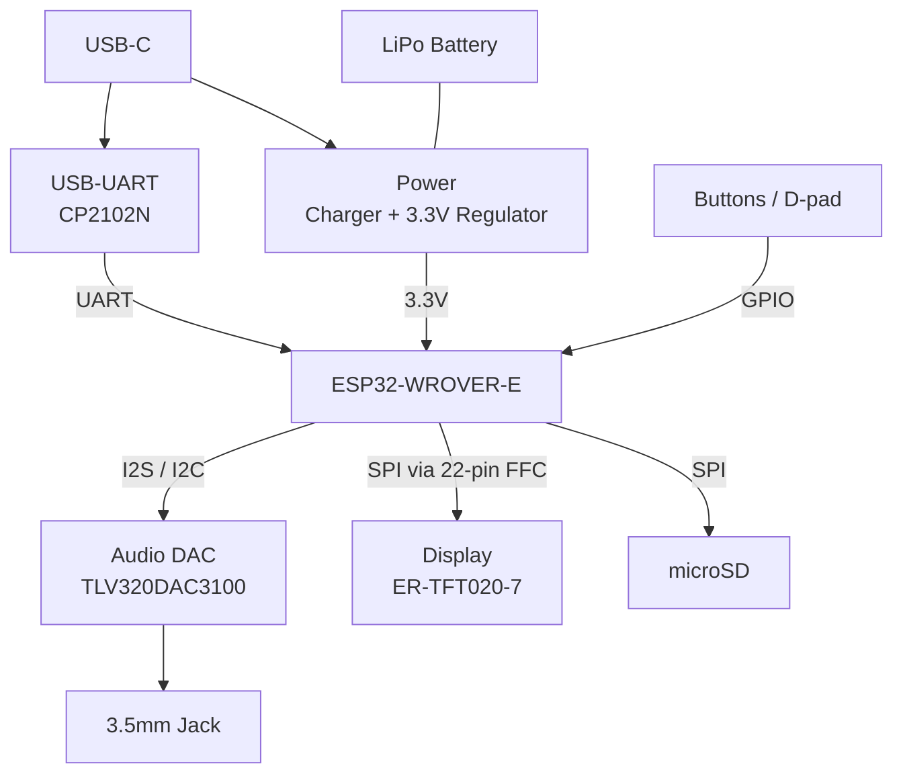

```mermaid
flowchart TB
    USB["USB-C"] --> UART["USB-UART<br/>CP2102N"]
    USB --> PWR["Power<br/>Charger + 3.3V Regulator"]
    BATT["LiPo Battery"] --- PWR
    PWR -->|3.3V| MCU

    UART -->|UART| MCU
    MCU["ESP32-WROVER-E"]

    MCU -->|I2S / I2C| DAC["Audio DAC<br/>TLV320DAC3100"] --> JACK["3.5mm Jack"]
    MCU -->|SPI via 22-pin FFC| DISP["Display<br/>ER-TFT020-7"]
    MCU -->|SPI| SD["microSD"]
    BTN["Buttons / D-pad"] -->|GPIO| MCU
```